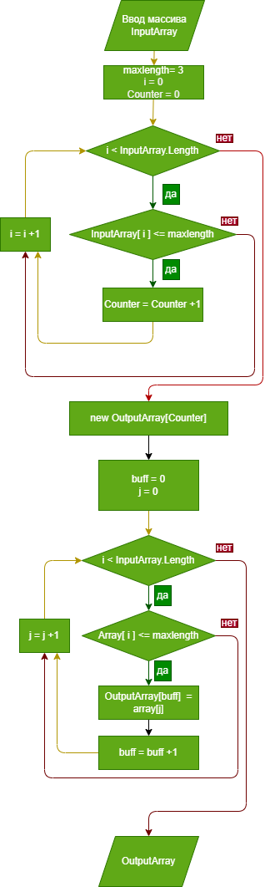

# Итоговая проверочная работа.

## **Задача**
Написать программу, которая из имеющегося массива строк формирует массив из строк, длина которых меньше либо равна 3 символа. Первоначальный массив можно ввести с клавиатуры, либо задать на старте выполнения алгоритма. При решении не рекомендуется пользоваться коллекциями, лучше обойтись исключительно массивами.

**Примеры**:

["hello", "2", "world", ":-)"] -> ["2", ":-)"]

["1234", "1567", "-2", "computer science"] -> ["-2"]

["Russia", "Denmark", "Kazan"] -> []

## Решение задачи
### Получение массива для работы
Массив для работы алгоритма можно вводить либо вручную, разделяя пробелами, либо использовать *учебный* массив, описанный в условии задачи.
Выбор действия происходит путем ввода цифры 1 или 2 и нажатия *Enter*

Пример учебного массива
**["hello", "2", "world", ":-)"]**

 Переменная **maxlength**, обозначающая максимальную длину элемента для отбора, согласно условиям задачи равна 3.

### **ArrayCountMax** - Метод подсчёта количества элементов, размер которых меньше maxlength
* С помощью циклического перебора всех элементов массива мы сравниваем длину *каждого элемента массива* и если она удовлетворяет условиям, счётчик нужных элементов увеличивается на 1.
* Подсчёт осуществляется перебором элементов массива *InputArray* и сравнением количества их элементов с переменной  *maxlength*.
* Результат выводится в переменную *Counter*.

* Далее создаётся новый массив OutputArray размером равный переменной *Counter*

* **FillOutputArray** - Метод заполняет OutputArray, подходящими по условию задачи значениями из InputArray посредством перебора элементов последнего.

* Следом мы выводим на экран получившийся массив методом *PrintArray*
